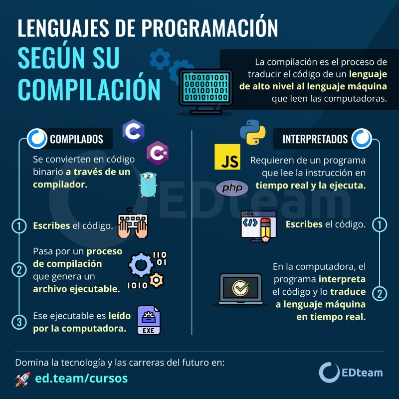
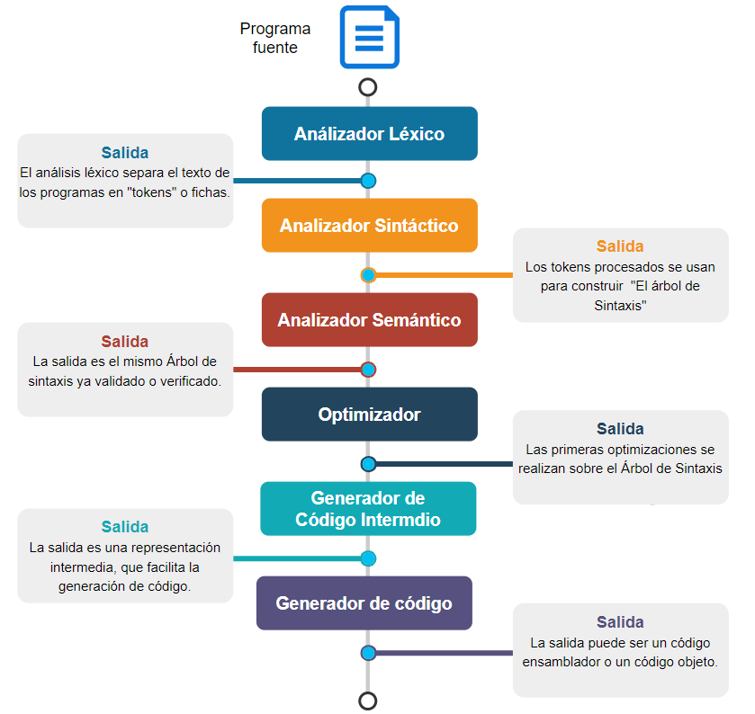
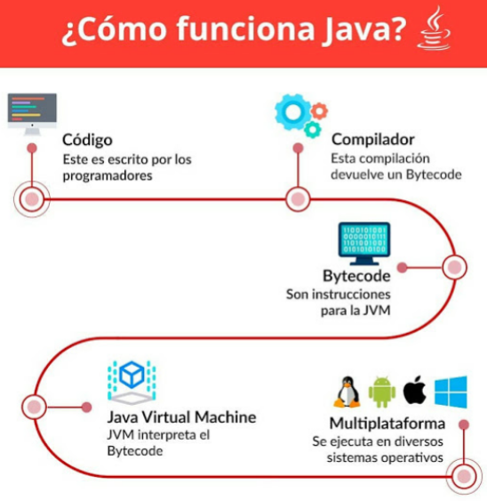
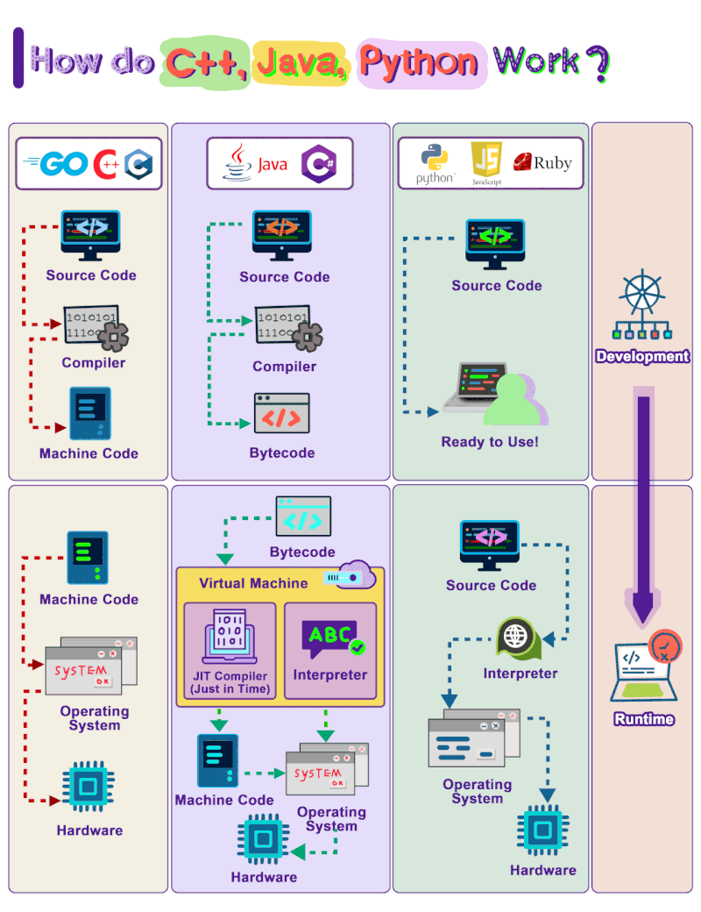

- [6. Proceso de Traducción, Máquinas Virtuales y Entornos de Ejecución](#6-proceso-de-traducción-máquinas-virtuales-y-entornos-de-ejecución)
  - [6.1. Proceso de Traducción: Compilación e Interpretación](#61-proceso-de-traducción-compilación-e-interpretación)
    - [6.1.1. Diferenciación entre Traducción, Compilación e Interpretación](#611-diferenciación-entre-traducción-compilación-e-interpretación)
    - [6.1.2. Fases de un Traductor (Compilador/Intérprete)](#612-fases-de-un-traductor-compiladorintérprete)
      - [1. Análisis Léxico (Scanner)](#1-análisis-léxico-scanner)
      - [2. Análisis Sintáctico (Parser)](#2-análisis-sintáctico-parser)
      - [3. Análisis Semántico](#3-análisis-semántico)
      - [4. Generación de Código Intermedio](#4-generación-de-código-intermedio)
      - [5. Optimización de Código](#5-optimización-de-código)
      - [6. Generación de Código Objeto](#6-generación-de-código-objeto)
      - [7. Enlazador (Linker) y Cargador (Loader)](#7-enlazador-linker-y-cargador-loader)
  - [6.2. Códigos Fuente, Objeto y Ejecutable](#62-códigos-fuente-objeto-y-ejecutable)
  - [6.3. Máquinas Virtuales y Entornos de Ejecución](#63-máquinas-virtuales-y-entornos-de-ejecución)
    - [6.3.1. Concepto de Máquina Virtual](#631-concepto-de-máquina-virtual)
    - [Funciones principales de una máquina virtual](#funciones-principales-de-una-máquina-virtual)
    - [6.3.2. Entornos de Ejecución (Runtime Environments)](#632-entornos-de-ejecución-runtime-environments)
    - [6.3.3. Frameworks](#633-frameworks)
    - [Ventajas de utilizar un framework](#ventajas-de-utilizar-un-framework)
    - [Inconvenientes](#inconvenientes)


# 6. Proceso de Traducción, Máquinas Virtuales y Entornos de Ejecución

**Objetivos de aprendizaje:**

- Diferenciar entre compilación, interpretación y formas mixtas
- Conocer las 7 fases de un traductor
- Entender la diferencia entre código fuente, objeto y ejecutable
- Comprender qué es una máquina virtual y por qué existe
- Conocer los entornos de ejecución y frameworks más comunes

## 6.1. Proceso de Traducción: Compilación e Interpretación

Para que el ordenador entienda algo escrito en un lenguaje de programación, debe pasar por un proceso de traducción de código. La traducción de un programa escrito en un lenguaje de programación a un lenguaje de máquina se realiza mediante un **traductor**, que puede ser un **compilador** o un **intérprete**.


- **Traducción**: Es el proceso general de transformar código de un lenguaje a otro.
- **Compilación**: Proceso que traduce el código fuente completo a código objeto o binario ejecutable en un solo paso. Un ejemplo es el compilador de C.
- **Interpretación**: Proceso que traduce y ejecuta el código fuente línea a línea, o instrucción por instrucción, sin generar un archivo intermedio. Un ejemplo es el intérprete de JavaScript.
- **Mixto**: Algunos lenguajes utilizan ambos métodos, compilando a un código intermedio (bytecode) que luego es interpretado por una máquina virtual. Un ejemplo es Java y C#.
- **Transpilación**: Proceso que traduce código de un lenguaje de alto nivel a otro lenguaje de alto nivel de similar nivel de abstracción. Un ejemplo es TypeScript → JavaScript.





| Característica | Compilación | Interpretación | Mixto |
|----------------|-------------|----------------|-------|
| **Traducción** | Todo de una vez | Línea a línea | Código intermedio + JIT |
| **Velocidad** | Rápida | Lenta | Media-buena |
| **Portabilidad** | Baja (por SO) | Alta | Alta |
| **Ejemplos** | C, C++, Go | PHP, Ruby | Java, C# |
| **Ejecutable** | Sí (.exe) | No | No (.dll + MV) |


> 💡 **Ejemplo real:** En Java: `MiApp.java` → javac (compilador) → `MiApp.class` (bytecode) → java (JVM) → Ejecución en Windows, Linux, Mac.


> 💡 **Ejemplo real:** TypeScript se usa porque ofrece tipos estáticos y más seguridad, pero los navegadores solo entienden JavaScript. El transpilador `tsc` o `Babel` resuelve esa brecha convirtiendo `.ts` a `.js`.


### 6.1.2. Fases de un Traductor (Compilador/Intérprete)

Un **traductor** es un programa que convierte el código escrito por un programador (código fuente) en un lenguaje que la máquina puede entender directamente (código máquina o código objeto). Este proceso no es una simple traducción palabra por palabra, sino que se lleva a cabo en varias fases bien definidas.




#### 1. Análisis Léxico (Scanner)

Es la primera fase del proceso. El **analizador léxico** lee el código fuente carácter a carácter y lo agrupa en unidades lógicas llamadas **tokens**. Un token representa una unidad léxica, como una palabra clave (`if`, `while`), un identificador (`variableX`), un operador (`+`, `=`), o un literal (`"hola mundo"`, `123`). También se encarga de eliminar comentarios y espacios en blanco.

**Ejemplo:** La línea de código `int suma = a + 5;` sería descompuesta en los siguientes tokens:

- `int` (token de palabra clave - KEYWORD)
- `suma` (token de identificador - ID)
- `=` (token de operador de asignación - ASSIGN)
- `a` (token de identificador - ID)
- `+` (token de operador de suma - PLUS)
- `5` (token de literal numérico - NUMBER)
- `;` (token de delimitador - SEMICOLON)

> 💡 **Analogía:** El análisis léxico es como un niño aprendiendo a leer que primero identifica letras, luego sílabas y finalmente palabras completas. El scanner hace lo mismo: caracteres → palabras → tokens.

#### 2. Análisis Sintáctico (Parser)

Una vez que los tokens han sido identificados, el **analizador sintáctico** toma esta secuencia y comprueba que la estructura del programa sea gramaticalmente correcta. Este proceso genera una representación jerárquica del código, conocida como **Árbol Sintáctico (o Árbol de Análisis)**, también llamado AST (Abstract Syntax Tree). Si la secuencia de tokens no cumple con las reglas gramaticales del lenguaje, se genera un error de sintaxis.


**Errores típicos de sintaxis:**
- Paréntesis sin cerrar: `if (x > 5 { ... }`
- Punto y coma faltante: `console.log("hola")`
- Palabra clave mal escrita: `whille (true) { ... }`

> 📝 **Nota:** Cuando el compilador dice "Syntax error at line 10", está diciendo que los tokens no se pueden organizar en una estructura válida según las reglas del lenguaje.

#### 3. Análisis Semántico

En esta fase se verifica el "sentido" del programa, asegurando que las operaciones sean lógicamente coherentes y permitidas. El **analizador semántico** comprueba aspectos como:

- **Compatibilidad de tipos:** Se asegura de que no se estén realizando operaciones entre tipos de datos incompatibles (ej. sumar un número a una cadena de texto).

  ```csharp
  // Error semántico en C# (tipado fuerte)
  int resultado = "texto" + 5;  // Error: Cannot implicitly convert type 'string' to 'int'
  ```

- **Declaración de variables:** Verifica que todas las variables utilizadas hayan sido declaradas previamente.

  ```csharp
  // Error semántico en C#
  Console.WriteLine(x);  // Error: The name 'x' does not exist in the current context
  ```

- **Número y tipo de argumentos:** Comprueba que las llamadas a funciones tengan el número y tipo de argumentos correctos.

  ```csharp
  // Error semántico en C#
  static int Sumar(int a, int b) => a + b;

  Sumar(1, 2, 3);  // Error: Too many arguments, expected 2
  ```

Si el código supera esta fase, se garantiza que es válido y tiene un significado claro, aunque esto no asegura que funcione como el programador espera.

> 💡 **Consejo:** Un programa puede tener sintaxis correcta pero semántica incorrecta. "El gato come la televisión" es gramaticalmente correcto pero no tiene sentido.


#### 4. Generación de Código Intermedio

Antes de producir el código máquina final, muchos compiladores generan un **código intermedio o bytecode**. Este es un lenguaje de bajo nivel, parecido al ensamblador, pero independiente de la arquitectura de la máquina de destino. Esta fase simplifica el diseño del compilador, ya que las optimizaciones pueden realizarse sobre este código genérico en lugar de sobre múltiples arquitecturas de máquina.


> 📝 **Nota:** Java usa el "bytecode" como código intermedio. Es como un ensamblador universal que todas las JVMs pueden entender.

#### 5. Optimización de Código

Esta fase es opcional pero crucial para el rendimiento. El **optimizador** mejora el código intermedio (o, en algunos casos, el código final) para que el programa resultante sea más eficiente. El objetivo puede ser reducir el tiempo de ejecución, minimizar el tamaño del archivo o disminuir el consumo de memoria. Existen diversas técnicas de optimización, como la eliminación de código redundante o la sustitución de expresiones por resultados precalculados.

**Técnicas comunes de optimización:**

| Técnica | Antes | Después |
|---------|-------|---------|
| **Const folding** | `x = 3 + 5` | `x = 8` |
| **Dead code elimination** | Código inalcanzable | Eliminado |
| **Loop unrolling** | `for(i=0;i<4;i++)` | `a[0];a[1];a[2];a[3];` |
| **Inlining** | Llamada a función | Código inline |

Ejemplo real: si escribes `const int x = 5 + 3;`, el compilador detecta que es una constante y reemplaza directamente `x` por `8` en el código generado, sin calcularlo en tiempo de ejecución. Esto se llama propagación de constantes.

> 💡 **Dato:** El compilador de C (gcc) con optimización `-O3` puede hacer que tu código sea 10-100 veces más rápido que sin optimizar, pero el código resultante es casi imposible de entender para humanos.

#### 6. Generación de Código Objeto

En esta fase, el código intermedio (ya optimizado) se convierte en **código máquina** de la arquitectura específica (por ejemplo, x86, ARM). El resultado es un archivo binario que contiene instrucciones que la CPU puede ejecutar directamente. Sin embargo, este código aún no es un programa completo, ya que las referencias a funciones o datos de otras partes del programa o de librerías externas están representadas por etiquetas simbólicas.

#### 7. Enlazador (Linker) y Cargador (Loader)

- **Enlazador (Linker):** Es el programa que toma uno o más archivos de código objeto y los combina con las **librerías** y rutinas necesarias (como las funciones para entrada y salida) para crear un único **archivo ejecutable** completo. El enlazador resuelve las referencias simbólicas, asignando direcciones de memoria reales. En lenguajes como C, esto incluye las instrucciones del preprocesador (ej. `#include`), que se encargan de incluir el contenido de otros archivos antes de la compilación.

> 💡 **Analogía:** El enlazador es como un editor de un libro que combina los capítulos escritos por diferentes autores (módulos) con el índice y las referencias cruzadas para crear un libro completo y coherente.

Ejemplo práctico: cuando escribes `System.out.printLn("Hola")` en Java, tu código no contiene la implementación de `System.out.printLn()`. El linker resuelve esta referencia conectando tu código con la clase `System` que sí contiene esa función.

- **Cargador (Loader):** Aunque no es parte del compilador, es la fase final que se encarga de cargar el archivo ejecutable en la memoria RAM y prepara su ejecución cuando el usuario lo inicia.


## 6.2. Códigos Fuente, Objeto y Ejecutable

Durante el proceso de codificación, el código pasa por diferentes estados:

- **Código Fuente**: Es el archivo de texto legible escrito por los programadores en un lenguaje de programación de alto nivel. Contiene el conjunto de instrucciones necesarias. Este código no es directamente ejecutable por la máquina y debe ser traducido. Un aspecto importante es su licencia: puede ser **abierto** (disponible para estudiar, modificar, reutilizar) o **cerrado** (no se tiene permiso para editarlo).

- **Código Objeto (Intermedio)**: Es un archivo binario no ejecutable. Es el resultado de traducir (compilar) el código fuente a un código equivalente formado por unos y ceros. En Java, el código objeto se denomina **Bytecode**. No siempre se genera código intermedio.

- **Código Ejecutable**: Es el archivo binario ejecutable directamente por la computadora. También conocido como **código máquina**. El sistema operativo es el encargado de cargarlo en memoria RAM y ejecutarlo. 

> 📝 **Nota:** Extensiones típicas:
> - `.cs`, `.java`, `.py`, `.js`, `.php` (código fuente)
> - `.class` (código objeto en java)
> - `.exe`, `.app` (ejecutable)


> 💡 **Dato:** Cuando desarrollas en Java, trabajas con código fuente (.java). El compilador javac genera bytecode (.class). Cuando ejecutas `java MiClase.class`, la JVM carga el bytecode y lo interpreta/JIT-compila a código máquina nativo, que se ejecuta.

## 6.3. Máquinas Virtuales y Entornos de Ejecución

### 6.3.1. Concepto de Máquina Virtual

> **OJO** Hablamos de la máquin virtual de los lenguajes de programación. No confundir con el software de virtualización de sistemas operativos (como VirtualBox).

Una **máquina virtual (MV)** es un tipo especial de software que permite leer el byte code en los lenguajes mixtos y adaptar dicho byte code a la máquina concreta donde se esté ejecutando. Esto garantiza la **portabilidad** de las aplicaciones, permitiendo desarrollarlas y ejecutarlas sobre cualquier equipo, independientemente de sus características hardware.

Sin máquinas virtuales, tendrías que compilar tu aplicación por separado para Windows, Linux y Mac. Con una MV, compilas una sola vez a código intermedio y el mismo ejecutable funciona en cualquier sistema operativo que tenga la MV instalada. Es como el traductor universal: tú hablas una vez y él traduce a cualquier idioma.


> 📝 **Nota:** Ejemplos de máquinas virtuales:
> - **JVM (Java Virtual Machine):** Java, Kotlin, Scala
> - **CLR (Common Language Runtime):** C#, VB.NET





### 6.3.2. Entornos de Ejecución (Runtime Environments)

Normalmente, la máquina virtual no viene sola, no se instala sola. Se incluye en un **entorno de ejecución**, que es un conjunto de utilidades que permiten la ejecución de programas. Se encarga de configurar la memoria principal, enlazar los archivos del programa con bibliotecas existentes y subprogramas creados, y depurar programas (comprobar errores semánticos).

El Entorno de Ejecución está formado por la máquina virtual y los **API's** (bibliotecas de clases estándar), que se distribuyen conjuntamente al necesitar ser compatibles. Funciona como intermediario entre el lenguaje fuente y el sistema operativo, ejecutando aplicaciones.

**Entornos de ejecución comunes:**

| Entorno | Lenguaje | Propósito |
|---------|----------|-----------|
| **JRE** (Java Runtime Environment) | Java | Ejecutar aplicaciones Java |
| **.NET 8/9/10 Runtime** | C# | Ejecutar aplicaciones .NET modernas |
| **Node.js** | JavaScript | Ejecutar JS en servidor |


### 6.3.3. Frameworks

Un **framework** (plataforma, entorno, marco de trabajo de desarrollo rápido de aplicaciones) es una estructura de ayuda para el programador, en base a la cual se pueden desarrollar proyectos sin partir desde cero. Es una plataforma software que define programas de soporte, bibliotecas, lenguajes interpretados, etc., ayudando a desarrollar y unir los diferentes módulos de un proyecto.

> 💡 **Analogía:** Un framework es como un kit de construcción de muebles IKEA. No tienes que diseñar las piezas desde cero, sigues las instrucciones del kit y lo montas.

### Ventajas de utilizar un framework

- **Desarrollo rápido de software**.
- **Reutilización de partes de código** para otras aplicaciones.
- **Diseño uniforme** del software.
- **Portabilidad de aplicaciones**, ya que los bytecodes generados pueden ser ejecutados sobre cualquier máquina virtual compatible.

### Inconvenientes

- **Curva de aprendizaje:** Tiempo para aprender el framework
- **Dependencia:** El código está acoplado al framework
- **Rendimiento:** Puede añadir overhead

Ejemplos de Frameworks son **.NET** (para Windows, con el ".Net framework" para la ejecución) y **Spring de Java** (conjuntos de bibliotecas para desarrollo y ejecución de aplicaciones).

**Frameworks por lenguaje:**

| Lenguaje | Frameworks populares |
|----------|---------------------|
| Java | Spring, SpringBoot, Jakarta EE, Vaadin |
| Python | Django, Flask, FastAPI |
| JavaScript | React, Vue, Angular |
| PHP | Laravel, Symfony |
| C# | .NET, ASP.NET, Entity Framework |

---

