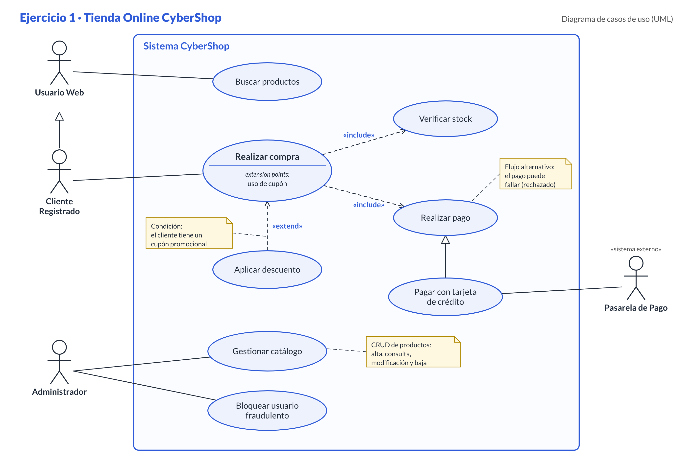

# Ejercicio 1: La Tienda Online "CyberShop" (Carrito de Compra)

## Enunciado

Una empresa de e-commerce necesita modelar su proceso de ventas. Cualquier usuario web puede buscar productos en el catálogo. Sin embargo, para realizar una compra, el usuario debe ser un **Cliente Registrado**. El proceso de **"Realizar Compra"** es el núcleo del sistema.
Para realizar la compra, el sistema **siempre** debe **"Verificar Stock"** de los productos. Además, durante la compra, si el cliente tiene un cupón promocional, puede **"Aplicar Descuento"** (esto no pasa siempre).
El pago se realiza dentro del proceso de compra, pero puede fallar. Si el pago es con tarjeta de crédito, el sistema conecta con una pasarela externa.
Existe un **Administrador** que puede gestionar el catálogo (CRUD de productos) y bloquear usuarios fraudulentos.

## Diagrama

## Solucion

 - **Generalización de actores**: Cliente Registrado hereda de Usuario Web. "Cualquier usuario web puede buscar productos", así que el cliente también puede buscar, y además es el único que puede comprar.

- **«include» de Realizar compra a Verificar stock:** el enunciado dice "siempre". Si un paso es obligatorio, se modela con include, y la flecha sale del caso base.
- **«include» de Realizar compra a Realizar pago:** el pago "se realiza dentro del proceso de compra". Comprar sin pagar no tiene sentido, así que también es obligatorio.
- **«extend» de Aplicar descuento a Realizar compra:** el enunciado dice "esto no pasa siempre". Es opcional y tiene una condición (tener cupón), así que la flecha va del caso que extiende al caso base. Le añadí el punto de extensión "uso de cupón" y una nota con la condición.
- **Generalización de casos de uso:** Pagar con tarjeta es una forma concreta de Realizar pago. Solo esa variante se conecta con la Pasarela de Pago.
- **Pasarela de Pago:** es un actor secundario, un sistema externo que va fuera del límite del sistema.
- **"El pago puede fallar":** no lo hice caso de uso. Un fallo es un flujo alternativo dentro de Realizar pago, así que lo puse como nota.
- **Administrador:** tiene Gestionar catálogo, que agrupa el CRUD (lo explico en una nota para no dibujar cuatro óvalos), y Bloquear usuario fraudulento.

