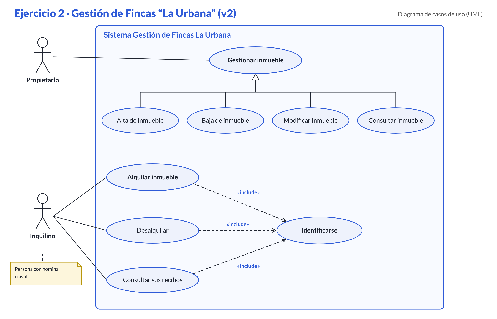
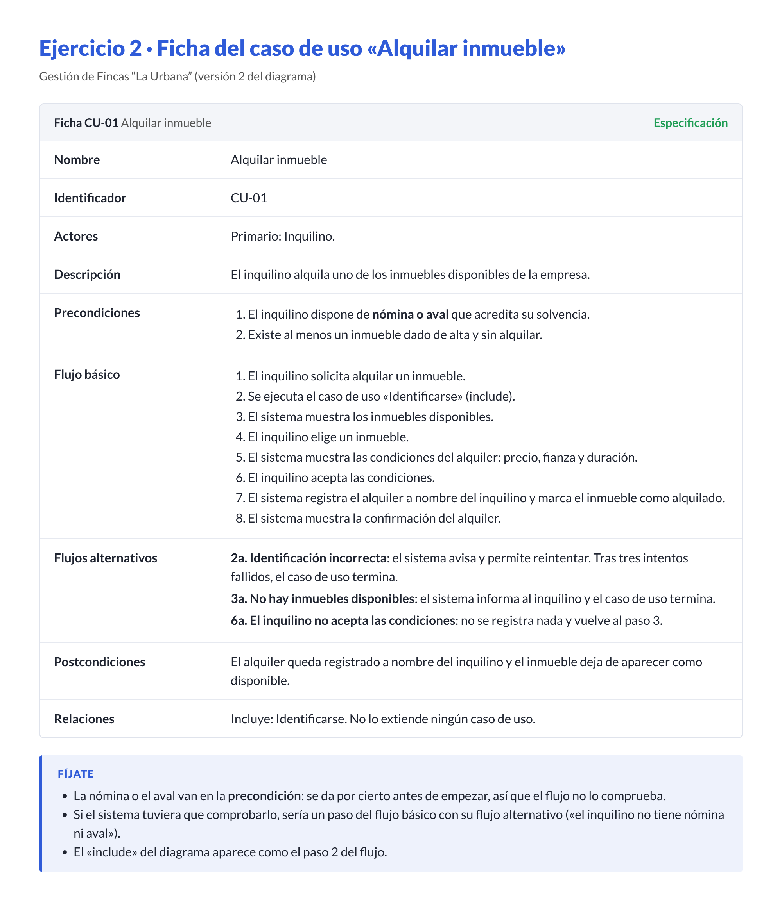

# Ejercicio 2: Gestión de Fincas "La Urbana" (CRUD Completo)

## Enunciado

Basado en el documento . Una empresa propietaria de inmuebles necesita un sistema.

## Ejercicio 2: Gestión de Fincas "La Urbana" (CRUD Completo)

Una empresa propietaria de inmuebles necesita un app para gestionar el negocio. 
* El propietario gestiona los inmuebles. El propietario debe poder dar de alta, baja, modificar y consultar (CRUD) dichos inmuebles.
* Existe un inquilino (será requisito previo presentar nómina o aval). El inquilino puede alquilar un inmueble.
* Para alquilar, siempre es necesario identificarse. El inquilino también puede desalquilar o consultar sus recibos, acciones que también requieren identificación obligatoria.

FICHA TEXTUAL: Crear la del caso de uso "Alquilar Inmueble". 

## Diagrama

## Ficha

